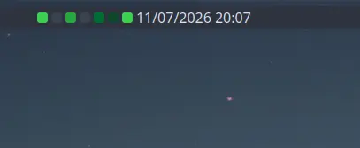

# Weekly Commits KDE
A widget to show your github contributions in the taskbar

> like [Weekly Commits](https://github.com/funinkina/weekly-commits) but for KDE


 
### IA notice

This is based on an ia generated code with some manual ajustement (see initial commit)

Because I was too lazy to learn how to make plasmoid

## Install

**Requires Plasma 6.**

```bash
kpackagetool6 -t Plasma/Applet -i weekly-commits-kde.plasmoid
```

To remove:

```bash
kpackagetool6 -t Plasma/Applet -r com.github.weekly-commits-kde
```

## Configure

Right-click the widget → **Configure Weekly commits kde**:

- **GitHub username** — required.
- **Refresh interval** — how often it polls GitHub (default 30 min).

## Develop

To build and run, execute these command

```bash
zip -r weekly-commits-kde.plasmoid ./metadata.json ./contents/
kpackagetool6 -t Plasma/Applet -u weekly-commits-kde.plasmoid
systemctl restart --user plasma-plasmashell.service
```


